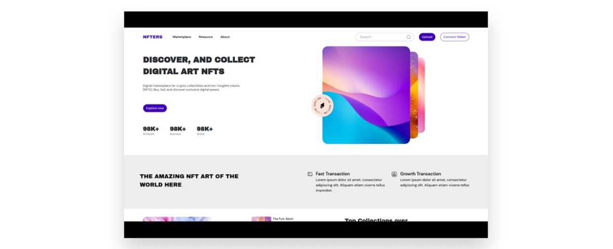
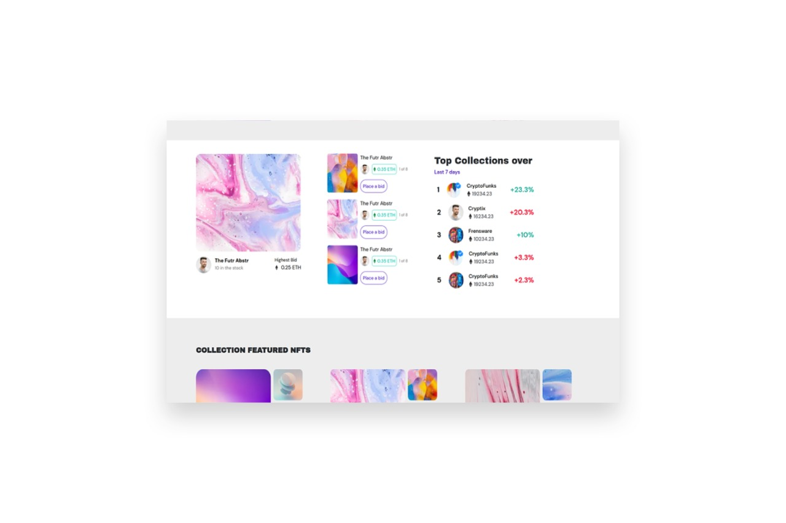
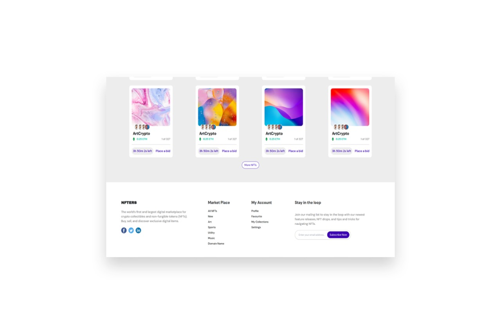

# NFTERS Playground Frontend Design

Developing a Figma Design into [Next.js](https://nextjs.org) Framework.

## Table of contents

- [Technologies](#technologies)
- [Install & Run](#installation)
- [Demo](#demo)
- [Shots](#shots)
- [Figma Design Copyright](https://www.figma.com/community/file/1062640529141404772/Website-NFT-Marketplace)

## Technologies

Frontend is created by:

- Next Js
- Tailwind CSS
- heroicons/react
- headlessui/react

## Demo
[Live Link](https://nfters.vercel.app/)

## Installation

Install nft-playgroud with npm on local machine

```bash
    git clone https://github.com/thisisrid/nft-playgroud.git
    npm install
    cd nft-playgroud
    npm run dev
    //Enjoy :D
```

## Author

- [@RIDWAN](https://www.github.com/thisisrid)

## Shots




